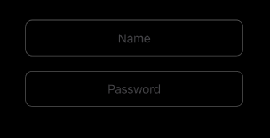
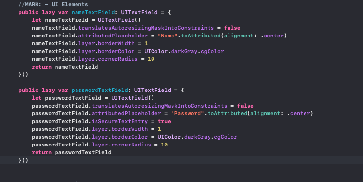

# Textfield-Placeholder-Alignment
An extension to insert the text field placeholder by aligning.

How do I use it ?

We should put the code in the Contents.swift file in a separate swift file as an extension. It is possible to use it on the desired textfield as in the example I gave below. I hope it will be useful.

